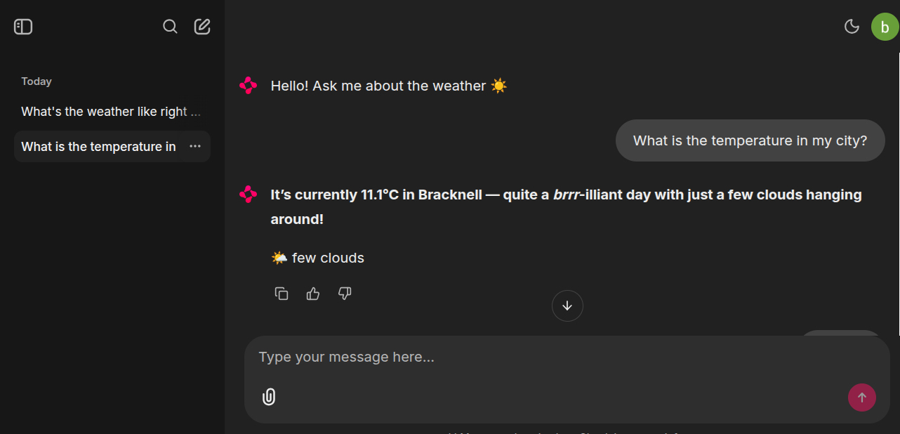

# 🌤️ Weather Agent

A weather chatbot built with **LangChain** and **Chainlit**. It gives punny, structured answers about the weather and supports chat history, tool calling, and optional Google OAuth.



## ✨ Features

- 🌡️ Real-time weather and auto location detection from IP
- 😄 Punny, structured responses
- 🔧 Tool calling (weather lookup, location)
- 💾 Chat history and agent memory (SQLite + Cosmos DB checkpointer)
- 🔐 Optional Google OAuth for the UI

## 🚀 Setup

1. **Clone and install**

   ```bash
   pip install -r requirements.txt
   ```

2. **Environment** — Copy `.env.example` to `.env`.

3. **Database (optional)**

   To init or reset the Chainlit SQLite DB:

   ```bash
   python scripts/init_db.py
   ```

## ▶️ Run

Start the chatbot UI:

```bash
chainlit run chainlit_app.py -w
```

The app is available at **http://localhost:8000/**.
